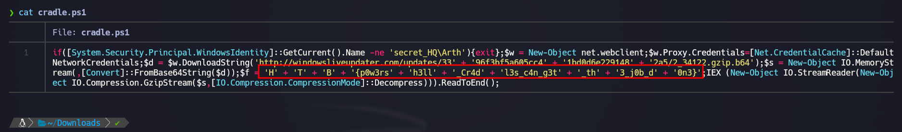
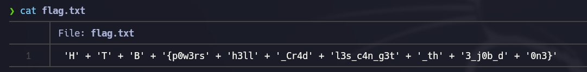

# Alien Cradle - Very easy (HTB Challenge)
Alien Cradle (invasión alienigena) es un reto "muy fácil" para desofuscar la flag que se encuentra en un script Powershell

## DESCRIPCIÓN DEL RETO (Traducción oficial)
En un intento por que los extraterrestres encontraran más información sobre la reliquia, lanzaron un ataque dirigido a los amigos y socios cercanos de Pandora que pudieran conocer información secreta sobre ella. Durante un incidente reciente que se cree que fue operado por ellos, Pandora localizó un extraño script de PowerShell en los registros de eventos, también llamado base de PowerShell. Estos scripts suelen utilizarse para descargar y ejecutar la siguiente etapa del ataque. Sin embargo, parece confuso y Pandora no puede entenderlo. ¿Puedes ayudarla a desenmascararlo?

## Preparación del entorno
En nuestro Kali Linux nos descargamos el fichero zip, y lo descomprimimos.

## Solución
Visualizamos el archivo con un "cat" y ya vemos la flag en el código de forma muy sencilla.
> Recuerda que el formato de flag en Hack The Box para los "challenges" es: HTB{cadena_de_texto}



Ahora mismo si vamos escribiendo con cuidado la flag en la plataforma ya lo tenemos, pero quiero enseñaros para hacerlo de una forma más eficiente y asentar conceptos de linux

Creamos un archivo, en mi caso flag.txt con algún editor (nano, vim...) y pegamos el texto completo de la flag (sin limpiar), y vamos a **eliminar caracteres**: comillas, espacios y signo de suma.

```shell
nano flag.txt
cat flag.txt | tr -d "\'" | tr -d " " | tr -d "+"
```
El resultado lo copiamos de Kali y lo pegamos en "Submit flag", por lo que si todo ha ido bien habremos superado este primer desafio.
¡Enhorabuena!


