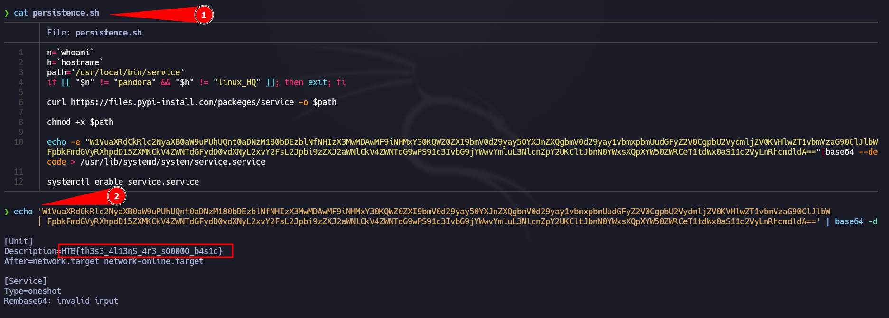
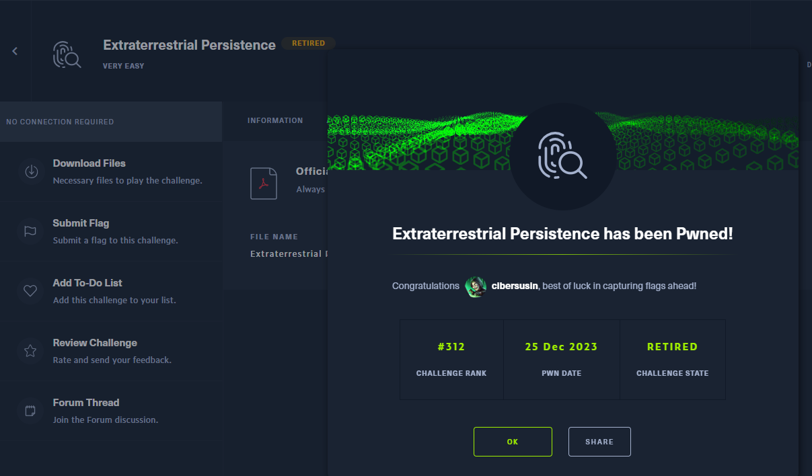

# Extraterrestrial Persistence - Very easy (HTB Challenge)
Tags: #linux #forensics

Extraterrestrial Persistence (invasión alienigena) es un reto "muy fácil" para desofuscar la flag que se encuentra en un script bash.

# Descripción del reto (Traducción oficial)
Existe el rumor de que los extraterrestres han desarrollado un mecanismo de persistencia imposible de detectar. Después de investigar su servidor Linux recientemente comprometido, Pandora encontró una posible muestra de este mecanismo. ¿Puedes analizarlo y descubrir cómo instalan su persistencia?

# Preparación del entorno
En nuestro Kali Linux nos descargamos el fichero zip, y lo descomprimimos.

# Solución
1. Lo que tenemos que hacer es visualizar el archivo con cat
2. Copiar la cadena de base64 y decodearla (ya sea con Linux o con alguna web)

```
echo cadena_base64 | base64 -d
```





