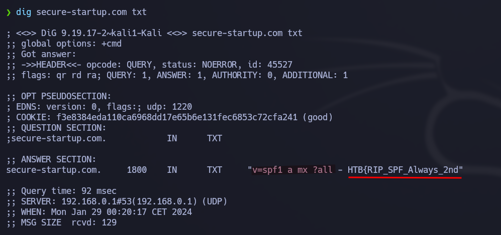

# Easy Phish - Very easy (HTB Challenge - OSINT)
Empezamos en OSINT con una de los desafios más sencillos que hay en la plataforma para ir entendiendo el procedimiento.

## DESCRIPCIÓN DEL RETO (Traducción oficial)
Los clientes de **secure-startup.com** han estado recibiendo algunos correos electrónicos de phishing muy convincentes. ¿Puedes descubrir por qué?

## Preparación del entorno
Este reto podemos descubrirlo de varias formas, pero recomendamos hacerlo desde Kali Linux por aprender a utilizar sus herramientas.

## Solución
Nos vamos a ayudar de la herramienta **Dig**, es una herramienta de línea de comandos de Linux que realiza búsquedas en los registros DNS.


### Primer analisis
Lo primero sería empezar por el comando sin argumentos:
``` shell
dig secure-startup.com
```
Pero no nos ofrece ningún dato interesante.


### Flag parte 1
si nos acordamos del enunciado nos decía que han estado recibiendo "correos electronicos" por lo que buscaremos en el TXT que suele haber información.

```shell
dig secure-startup.com TXT
```

Aquí encontramos la segunda parte de lo que parece ser la flag: *HTB{RIP_SPF_Always_2nd*

Encontramos un mensaje interesante: "spf1 a mx", por lo que vamos a mirar el spf 
```shell
dig _spf.secure-startup.com TXT
```
Pero no encontramos inforamción interesante.


### Flag parte 2

```shell
dig _dmarc.secure-startup.com TXT
```
Ahora sí que tenemos la segunda parte: *_F1ddl3_2_DMARC}*


El resultado lo copiamos de Kali y lo pegamos en "Submit flag", por lo que si todo ha ido bien habremos superado este desafio.
¡Enhorabuena!


