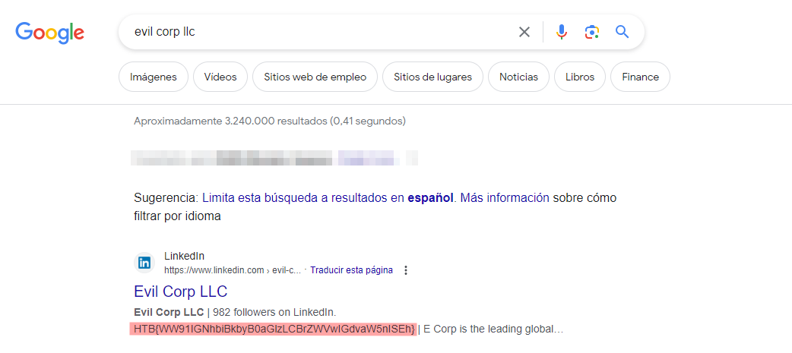
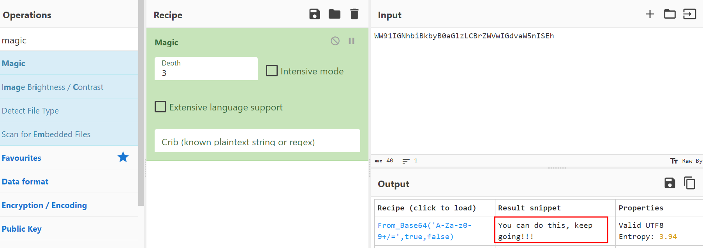
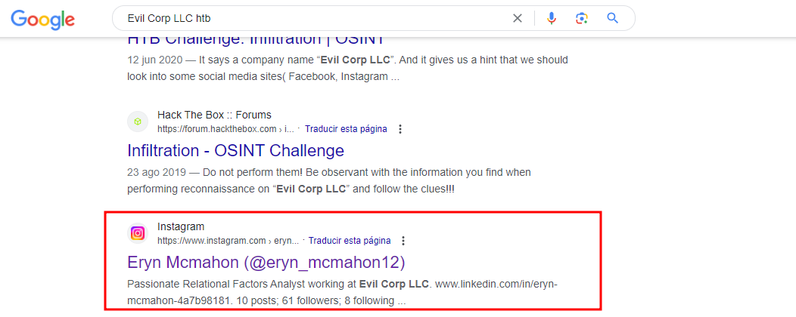
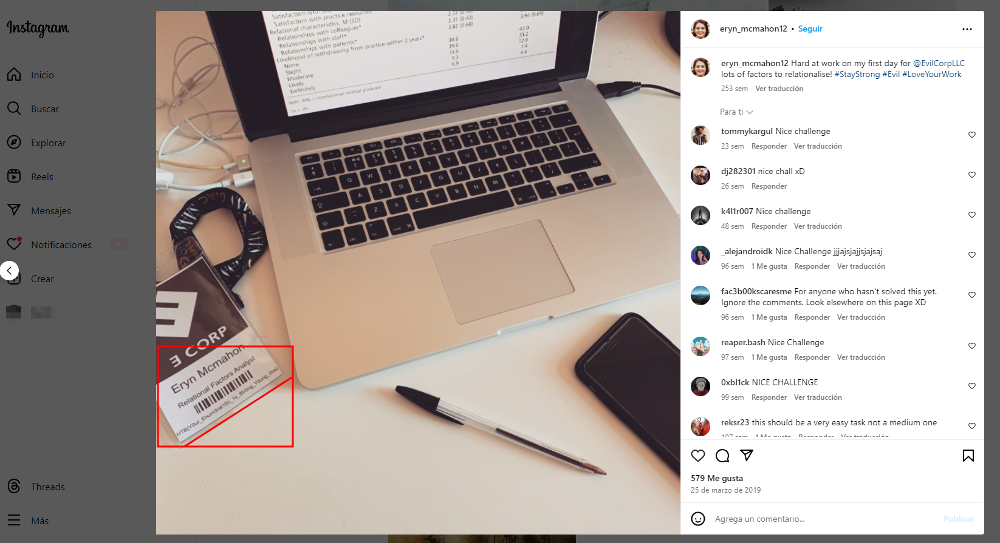
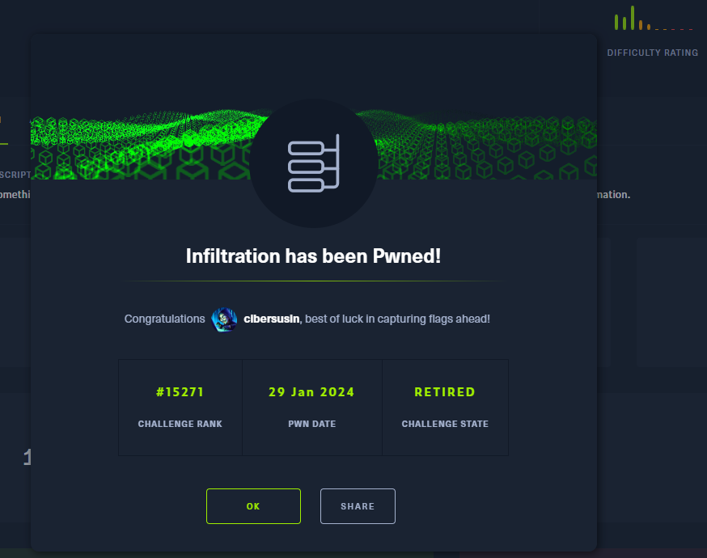

# Infiltration - Very easy (HTB Challenge - OSINT)
Empezamos en OSINT con una de los desafios más sencillos que hay en la plataforma para ir entendiendo el procedimiento.

## DESCRIPCIÓN DEL RETO (Traducción oficial)
¿Puede encontrar algo que le ayude a entrar en la empresa '**Evil Corp LLC**'?
Reconozca los sitios de redes sociales para ver si puede encontrar información útil.

## Preparación del entorno
 Para este reto no necesitamos estar en ningun entorno especial, con un navegador podemos solventar todo el caso.

## Primera flag
Buscamos Evil Corp LLC en Google y nos encontramos una flag clarisima en la descripción de la empresa en Linkedin.

La comprobamos y es erronea... ¿Podría estar codificada? Así que revisamos en **cyberchef** con la función "Magic" que puede ser.

El texto es Base64 pero nos han vuelto a trolear, esto era un callejón sin salida.

### Segunda flag.
Encontramos una segunda pista en instagram, al parecer ser de una empleada

Si nos fijamos bien la flag está en su credencial de acceso.

Al estar de una forma complicada de lectura después de probar con varios OCR no consigo una forma eficiente de hacerlo que no sea transcribir lo que vemos.
Así que comprobamos la flag (mirad bien los ceros) que pueden causar confusión, si lo hemos copiado bien ya habremos acabado.
¡Enhorabuena!

