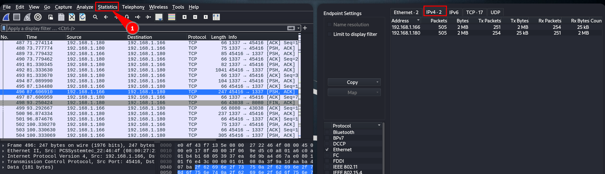
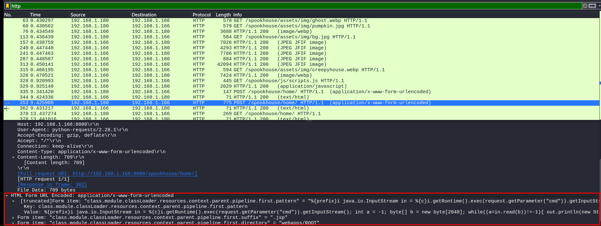
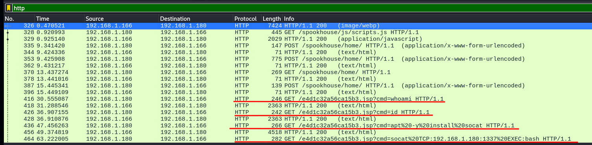
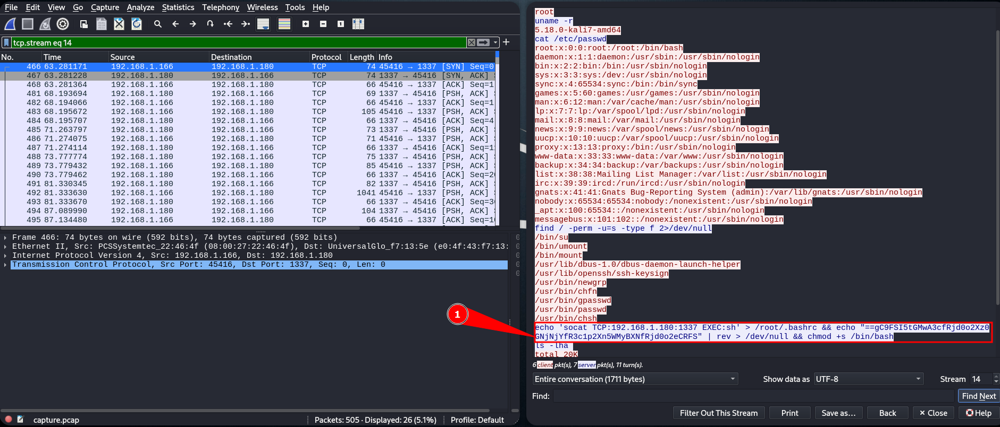
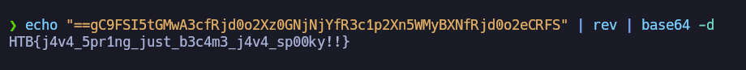
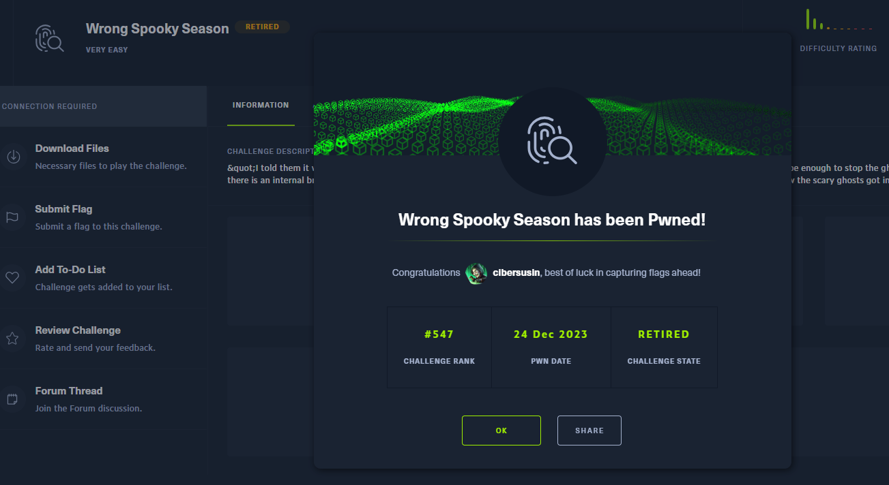

# Wrong Spooky Season - Very easy (HTB Challenge)
Wrong Spooky Season (Temporada espeluznante equivocada) es un reto "muy fácil" para desofuscar la flag que se encuentra en una captura de tráfico pcap.

# Descripción del reto (Traducción oficial)
"Les dije que era demasiado pronto y en la temporada equivocada para implementar un sitio web así, pero me aseguraron que tematizarlo adecuadamente sería suficiente para evitar que los fantasmas nos persiguieran. Me equivoqué." Ahora hay una brecha interna en la "Spooky Network" y necesitas descubrir qué pasó. 

**Analiza el tráfico de la red y descubre cómo entraron los aterradores fantasmas** y qué hicieron.

# Preparación del entorno
Para este reto necesitamos Wireshark, por lo que podemos utilizar Windows, como Kali, ya que no vamos a tener ninguna diferencia.

# Enumeración
## Equipos 
Lo primero es saber entre que equipos se están efectuando el tráfico de red, por lo que listaremos los equipos: En el panel superior vamos a "Statistics" > "Endpoints", y en la pestaña IPv4 identificamos 2.
- 192.168.1.180 : Cliente  
- 192.168.1.166 : Servidor

También visualizar la pestaña "TCP" ya que nos puede dar pistas de que puertos están abiertos y la cantidad de bytes / paquetes enviados y recibidos.

## Tráfico http
Vemos que se piden varios recursos por "GET", pero en la línea 
Línea 353 aprovechando un formulario detectamos que sube una webshell de jsp


Posteriormente ejecuta comandos a través de un RCE (Remote Code Execution), ejecutando whoami, id, instala socat y realiza una conexión para conseguir una shell en bash.


Nos fijamos que la reverse shell utiliza el puerto 1337, así que filtramos por **tcp.port==1337** 
Ahora en el menú superior "Analyze" > "Follow" > "TCP Stream" que nos mostrará las peticiones y respuestas de esta comunicación TCP.


# Solución 
Para llegar a la flag la encontramos en la ejecución de comandos en base64, acordaos que lo delata el formato: "==".


La forma más sencilla es copiarnos toda la cadena en una shell y encadenar un decode base64 

```shell
echo "==gC9FSI5tGMwA3cfRjd0o2Xz0GNjNjYfR3c1p2Xn5WMyBXNfRjd0o2eCRFS" | rev | base64 -d 
```




